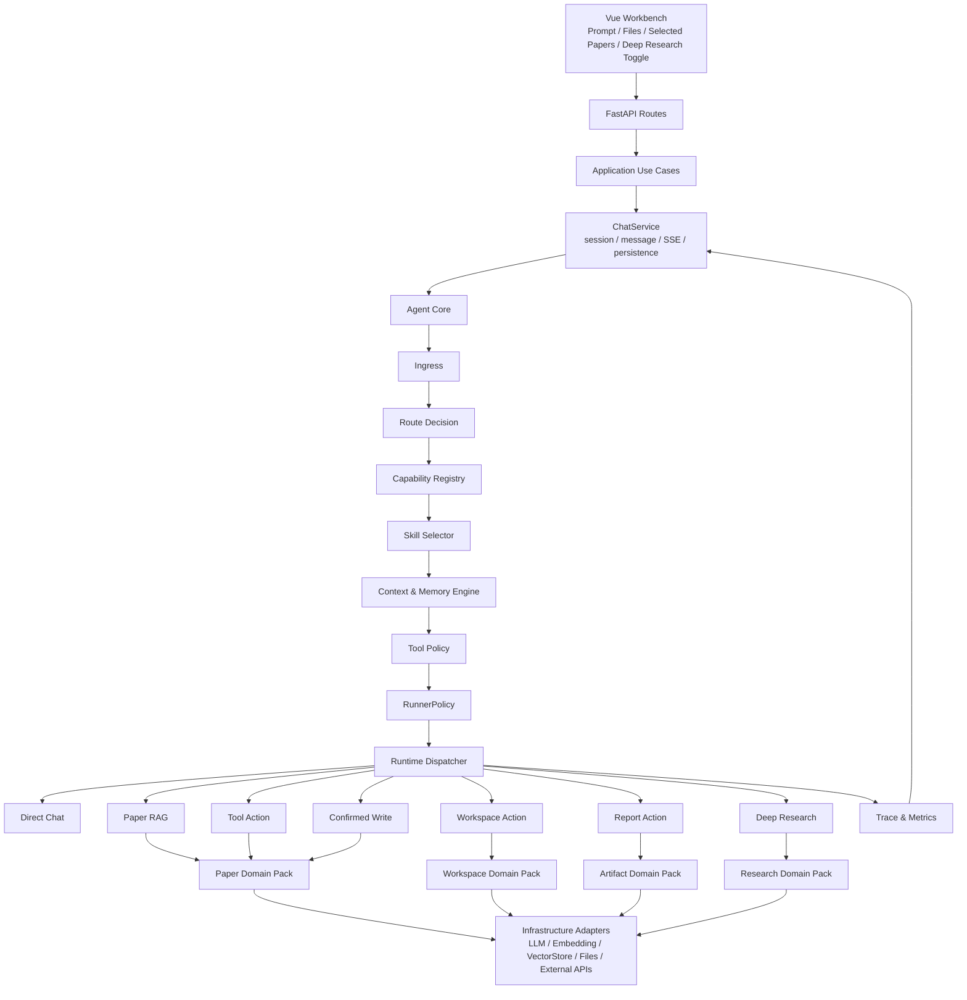
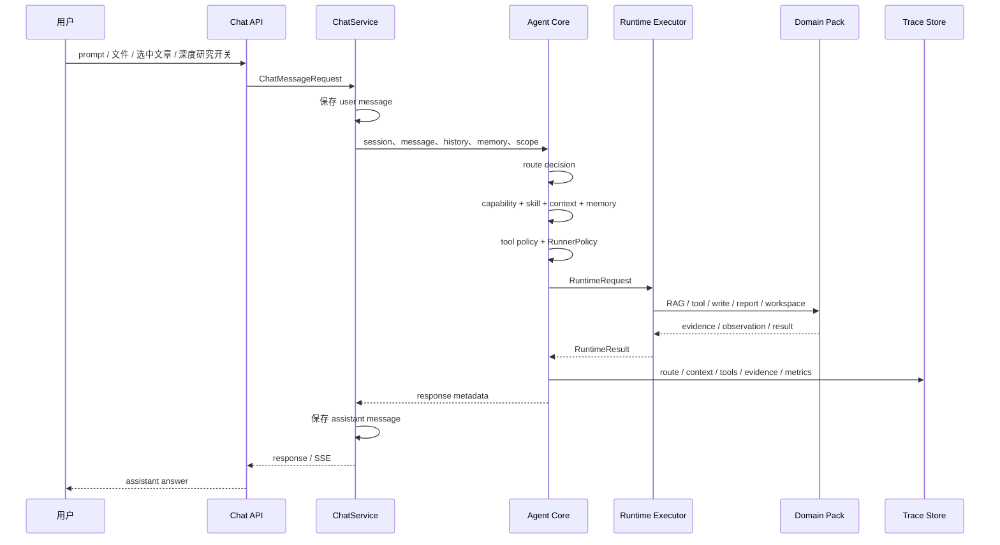
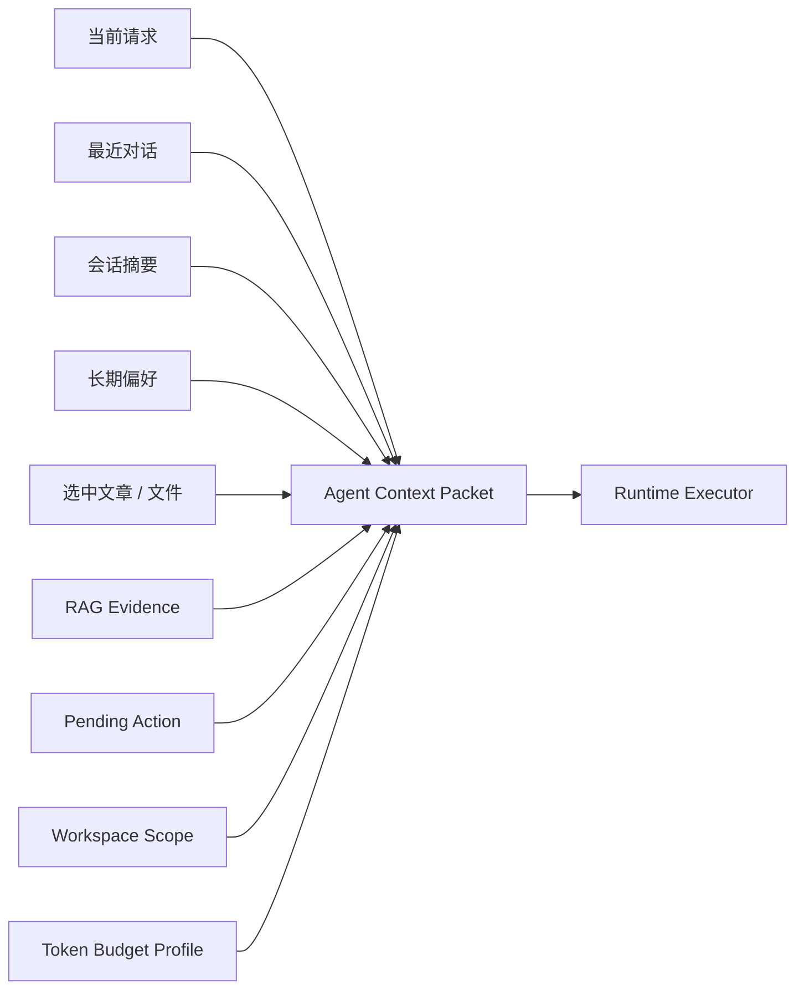
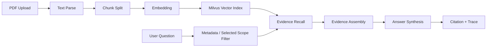

# PaperDesk

PaperDesk 是一个面向论文阅读、论文库管理和研究写作的轻量 Agent 应用。它把论文上传、PDF 解析、向量检索、证据问答、选中文章综述、标签分类、报告保存、普通聊天和工作区文件操作放在同一条对话链路中，并通过 Agent Core 管理路由、上下文、记忆、工具、安全和运行追踪。

项目定位是“可扩展的论文阅读 Agent”。当前核心能力围绕论文业务闭环展开，同时为后续接入 draw.io、token 消耗统计、外部知识源、MCP 工具、自定义 Skills 等能力保留清晰的扩展路径。

## 功能概览

- 论文上传与解析：上传 PDF 后解析正文、生成 chunk、写入论文库并建立向量索引。
- 论文 RAG 问答：支持选中文档范围、metadata 过滤、证据拼接、引用返回和无证据边界提示。
- 论文综述与对比：围绕选中文章生成总结、方法解释、创新点对比和综述草稿。
- 标签分类管理：支持标签/分类查看、创建、重命名、分配和清理，写操作需要明确 scope 与确认。
- 报告保存：将对话中的研究结果保存为报告，并支持导出。
- 普通聊天：无论文意图时走轻量直接回答链路，避免强行进入论文库或工具链。
- 会话文件与工作区：支持会话文件读取、工作区文件读取、新建文件和覆盖确认。
- 自定义 Skills：支持内置与用户自定义 Skill，Skill 可声明触发条件和工具请求，最终工具暴露由 Tool Policy 决定。
- Trace 与调试：记录 route、runtime、context、memory、tool policy、RAG evidence、写操作 scope 和错误原因。

## 技术栈

| 模块 | 技术 |
| --- | --- |
| 前端 | Vue 3、TypeScript、Vite、Pinia |
| 后端 | FastAPI、Pydantic、SQLite |
| Agent | Lifecycle、Route Decision、Runtime Dispatcher、RunnerPolicy、Tool Registry、Skills、Safety、Trace |
| RAG | PDF 解析、chunk 切分、Embedding、Milvus、metadata filter、evidence assembly |
| 工程能力 | SSE 流式输出、写操作确认、运行追踪、runtime metrics、domain pack 分层 |

## 项目截图

| 对话与 RAG | 论文库与标签 |
| --- | --- |
|  |  |

| 报告保存 | Skills 与会话文件 |
| --- | --- |
|  |  |

## 架构设计



整体分层采用 `Agent Core + Domain Pack + Infrastructure Adapter`：

- Agent Core 负责请求入口、路由判断、能力解析、Skill 选择、上下文装配、记忆注入、工具过滤、RunnerPolicy、运行时分发、写操作安全和 trace。
- Domain Pack 承载论文、报告、工作区、研究任务等业务能力，保持业务规则边界清晰。
- Infrastructure Adapter 隔离 LLM、Embedding、Milvus、文件系统、OpenAlex、arXiv 等外部依赖。
- ChatService 收敛为会话、消息、SSE、错误处理和最终结果持久化协调层。

## Agent 生命周期



用户只需要使用对话框、文件上传、选中文章、深度研究开关和自定义指令。普通回答、论文问答、工具查询、写操作确认和深度研究由 Agent 内部判断。

## 路由与编排

Agent Core 使用一套内部运行时词汇描述请求走向，普通用户无需选择这些策略。

| 内部场景 | Route | 编排策略 | Runtime | 最大步数 |
| --- | --- | --- | --- | ---: |
| 普通聊天 | `direct_chat` | `single-turn` | `DirectChatRuntime` | 1 |
| 论文问答、总结、对比 | `paper_rag` | `retrieve-then-synthesize` | `PaperRagRuntime` | 1 |
| 论文库只读查询 | `library_read` / `tool_action` | `bounded-react` | `ToolActionRuntime` | 4 |
| 标签、分类、删除、覆盖等写操作 | `write_pending` / `write_confirmed` | `preview-confirm-execute-verify` | `ToolActionRuntime` / `ConfirmedWriteRuntime` | 3 |
| 报告保存与导出 | `report_action` | `service-workflow` | `ReportActionRuntime` | 2 |
| 工作区文件 | `workspace_read` / `workspace_write` | `service-workflow` / `preview-confirm-execute-verify` | `WorkspaceActionRuntime` | 2-3 |
| 深度研究 | `experimental_research` | `plan-execute-replan` | `ExperimentalRuntime` | 6 |

RunnerPolicy 是 loop 策略的统一来源，负责 max steps、stop reason、RAG/tools/planner 开关、显式 scope 要求和 trace payload。普通聊天和论文 RAG 都是单轮策略；工具查询使用有限轮工具执行；写操作使用预览、确认、执行、验证；深度研究通过 feature flag 和策略上限控制。

## 上下文管理



上下文由 Agent Core 统一装配，runtime 消费 `ContextPacket`。主要内容包括最近对话、会话摘要、长期偏好、选中范围、RAG 证据、pending action、工作区 scope 和 token budget。

| Profile | 配置窗口 | 输出预留 | 典型用途 |
| --- | ---: | ---: | --- |
| `small` | 8K / 8192 | 1K / 1024 | 普通聊天、短论文问答、工具查询 |
| `standard` | 32K / 32768 | 4K / 4096 | 默认论文阅读、多轮对话、选中文章综述 |
| `large` | 128K / 131072 | 8K / 8192 | 长上下文综述、多文档对比、深度研究 |

有效窗口会结合模型 metadata 或显式配置取上限。滑动窗口优先按 token budget 保留最近消息，消息条数仅作为异常碎片化场景的 fallback cap：8K/32K 默认 24 条，128K 默认 48 条。

压缩顺序固定为三段：

1. evidence compact：RAG 证据过长时先压缩证据。
2. history summary：超过强制阈值后，将离开窗口的旧对话压缩成会话摘要。
3. hard trim：仍然超限时裁剪低优先级最近消息，同时保留当前任务、安全指令、选中范围和必要证据头。

context state 会记录 `context_profile`、`effective_context_window`、`retained_message_count`、`dropped_message_count`、`truncated_sections` 和压缩阶段，便于调试。

## 记忆管理

PaperDesk 使用轻量记忆体系：

- 短期记忆：当前 token-budgeted sliding window，直接服务本轮回答。
- 中期记忆：会话摘要与 compact summaries，只在旧消息离开窗口后生成。
- 长期记忆：稳定、可复用、有来源的用户偏好或高价值反思经验。

长期记忆写入有准入规则。稳定偏好需要具备跨会话复用价值，并带有 source metadata；“这次”“本轮”“当前任务”“临时”等一次性指令保留在当前上下文或会话自定义指令中。自定义指令采用“全局默认 + 会话可覆盖”，优先级为 system policy、global custom instruction、session custom instruction、current user task。

## RAG 设计



论文场景保留必要 RAG 能力：

- PDF 正文解析与基础 metadata。
- 按页面和段落切分 chunk，保留文档 id、页码、标题、版本等 metadata。
- 使用 Embedding 与 Milvus 建立向量索引。
- 支持选中文档、文档 id、分类、标签等过滤。
- 召回 evidence 后拼接正文片段、页码、标题和引用信息。
- 证据不足时明确说明边界，避免把无证据内容写成确定结论。

## Skills

Skills 支持内置和用户自定义。一个 Skill 可以声明触发方式、适用能力、工具请求和输出协议。

```json
{
  "skill_id": "custom_review",
  "name": "自定义论文评审",
  "enabled": true,
  "capability_ids": ["paper"],
  "allowed_tool_ids": ["search_local/vector_recall_default"],
  "trigger": {
    "keywords": ["custom-review"],
    "routes": ["paper_rag"],
    "capability_ids": ["paper"]
  }
}
```

Skill 负责表达任务偏好和工具请求。最终可用工具由 Tool Registry 与 Tool Policy 根据 route、capability、scope、risk、feature flag、外部绑定状态和确认状态过滤。MCP 与外部工具需要用户显式绑定或配置后才会进入候选池。

## Tool Registry 与写操作安全

工具统一声明以下 metadata：

- tool id、描述、输入输出 schema；
- capability id、scope、integration source；
- read/write 类型；
- operation level；
- destructive 标记；
- confirmation requirement；
- verification 与 observation 规则；
- feature flag 与外部绑定要求。

写操作统一遵循：

```text
preview -> pending action -> explicit confirmation -> execute -> verification
```

安全约束：

- 模糊指代不会默认执行全库写操作。
- 删除、覆盖、清空、批量改标签必须有明确 scope。
- 未确认前不会暴露危险写工具。
- 工具结果统一回灌为结构化 observation，便于 trace 和调试。
- Tool Policy 对 Skill 绑定工具有最终控制权，并记录过滤原因。

## 可观测性

Agent 运行过程记录轻量 trace 与 metrics：

- route、runtime、orchestration pattern；
- active capability 与 active skill；
- context scope、selected documents、selected files；
- allowed / filtered tools 以及过滤原因；
- RAG evidence count、metadata filter、citation；
- pending action、write scope、verification；
- response status、error reason；
- token usage availability。

当模型供应商没有返回 token 信息时，系统记录 `token_usage_available=false`，请求仍可正常完成。

## 扩展方式

新增能力建议沿着以下路径接入：

```text
Capability Declaration
  -> Domain Pack
  -> Tool Metadata
  -> Runtime Binding
  -> API / UI Entry
  -> README / Docs
```

示例：

- draw.io：新增图形产物 domain 或复用 artifact domain，在 integration adapter 中接入 draw.io，在 Tool Registry 声明创建、编辑、导出工具。
- token_usage：在 observability 中扩展 usage 聚合，在 Tool Registry 声明只读查询工具，通过 API 暴露会话维度的 token、latency、cost 信息。
- 外部知识源：通过 capability 和 integration adapter 接入，工具暴露由绑定状态、feature flag 和 Tool Policy 控制。

## 快速启动

后端：

```bash
cd backend
uv sync
.venv\Scripts\python.exe -m uvicorn app.api.main:app --reload --host 127.0.0.1 --port 8000
```

前端：

```bash
cd frontend
npm install
npm run dev
```

默认访问：

```text
Frontend: http://127.0.0.1:5173
Backend:  http://127.0.0.1:8000
```

## API 概览

| 能力 | API |
| --- | --- |
| 会话列表 | `GET /api/chat/sessions` |
| 创建会话 | `POST /api/chat/sessions` |
| 发送消息 | `POST /api/chat/sessions/{session_id}/messages` |
| SSE 流式消息 | `POST /api/chat/sessions/{session_id}/messages/stream` |
| 上传论文 | `POST /api/documents/upload` |
| 文档列表 | `GET /api/documents` |
| RAG 问答 | `POST /api/rag/ask` |
| 报告列表 | `GET /api/reports` |
| 保存报告 | `POST /api/reports/from-message` |
| Workbench trace | `GET /api/workbench/messages/{message_id}/trace` |

## 验证

```bash
backend\.venv\Scripts\python.exe -m compileall -q backend\app backend\tests
backend\.venv\Scripts\pytest.exe -q backend\tests
cd frontend
npm run build
```

## 联系

项目维护者：Hddcc

GitHub：https://github.com/Hddcc/Paperdesk
