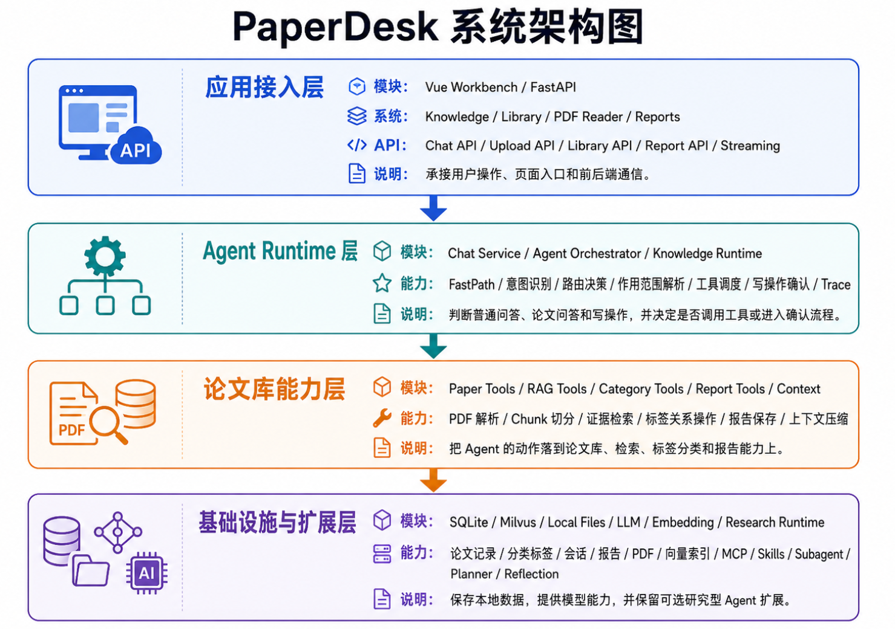

# PaperDesk

PaperDesk 是一个面向科研论文管理、论文问答、AI 分析和报告沉淀的本地优先论文工作台。它围绕“把自己的论文库变成可检索、可分析、可沉淀的研究助手”这一目标，提供从论文入库、聊天附件读取、知识问答、报告保存到工作区文件生成的完整流程。

> Tips
>
> 本项目为纯 vibe coding 项目，可以用来学习参考，也欢迎你在这个基础上继续改进和扩展。

## 内容导航

| 模块 | 内容 |
| --- | --- |
| 📚 [1. 系统功能介绍](#1-系统功能介绍) | 论文库、问答、附件、工作区文件、报告、分类、阅读入口 |
| 🚀 [2. 快速使用](#2-快速使用) | 环境、下载、配置、启动、校验 |
| 🧭 [3. 项目结构](#3-项目结构) | 目录结构、运行结构视角 |
| 🤖 [4. Agent 架构介绍](#4-agent-架构介绍) | 主流程、Skills、路由、上下文、工具调用 |
| 📮 [5. 联系方式](#5-联系方式) | 联系方式 |

## 1. 系统功能介绍

PaperDesk 的核心目标是让用户把本地论文库真正用起来：先把 PDF 上传到本地论文库，再由系统完成解析、切分、索引和检索，之后就可以在知识库对话中选择论文、提出问题、生成总结、对比多篇论文。用户也可以在聊天框直接上传 PDF、TXT、MD、DOCX 作为本轮只读附件，让 PaperDesk 先读材料再回答。一次有价值的回答可以保存为报告，也可以保存成会话工作区里的 Markdown 或 TXT 文件。


### 1.1 本地论文库管理

用户可以在 `Library` 页面上传 PDF。PaperDesk 会为论文建立本地记录，解析正文内容，切分为可检索片段，并写入本地知识库索引。上传后的论文会显示处理状态、页数、文件名、标题和分类标签，方便用户判断论文是否已经可以用于问答和分析。

论文库支持基础的整理操作，包括查看全部论文、刷新处理状态、删除论文记录、打开 PDF 阅读入口，以及按分类筛选论文。当前主要支持 PDF 文件。


### 1.2 AI 论文问答与分析

在 `Knowledge` 页面，用户可以直接和 PaperDesk 助手对话，也可以从论文库中选择一篇或多篇已入库论文，让 AI 围绕这些论文进行回答。常见用法包括：

- 解释某篇论文的核心问题、方法、贡献和局限。
- 对比多篇论文的研究目标、技术路线和实验差异。
- 根据选中的论文生成总结、综述、阅读笔记或研究分析。
- 结合论文库中的证据回答用户提出的具体问题。

PaperDesk 会尽量基于库内论文的真实检索结果来回答，并把模型的表达能力用于整理、解释和组织这些证据。对于证据不足的情况，系统会在回答中保留说明，减少把缺少证据支撑的内容写成确定结论的情况。

对于“这篇论文讲了什么”“用一段话概括”“解释一下方法”这类综合问题，检索会同时走向量召回和关键词召回，并自动补充 summary、overview、abstract、method、experiment、conclusion 以及中文的摘要、方法、实验、结论、主要内容等查询线索。排序时会更看重两条路线都命中的片段，以及摘要、引言、方法、实验、结果、结论等正文内容；参考文献、致谢、附录一类片段会被排到更靠后的位置。

PaperDesk 也可以作为普通 AI 助手使用。闲聊、概念解释、编程说明等请求会按普通问答自然回复，并尽量跳过完整路由判断；当用户选择论文，或者提到论文库、标签、分类、报告时，系统会进入论文库能力流程。其中纯粹的数量、页数、标题、作者、标签列表等只读字段查询，会优先通过本地确定性读取返回；涉及解释、分析、对比、报告、后续处理或写操作的混合请求，会进入正常 Agent 链路。

普通对话：


论文分析：


### 1.3 聊天附件与工作区文件

`Knowledge` 页面的聊天框支持上传 PDF、TXT、MD、DOCX。这些文件会作为当前会话的只读附件进入上下文，适合让助手总结一份资料、翻译一段文档、提取关键词、解释方法或给出整理建议。

这里的聊天附件和论文库论文分成两条使用路径：

- 聊天框上传的文件会保存为会话附件，用 `selected_file_ids` 参与本轮回答，只在当前会话中作为阅读材料使用。
- `Library` 页面上传的 PDF 会进入论文库，用 `selected_document_ids` 参与论文问答、RAG 检索、分类标签和报告引用。

助手回答后，用户可以把结果保存成工作区文件。目前支持把助手消息保存为 Markdown 或 TXT，并记录文件名、来源消息和关联材料。工作区还提供受保护的文件读取、新建文件和覆盖编辑预览：读取和新建走安全路径，覆盖已有文件会先生成差异预览，等用户确认后再写入。命令执行、删除、重命名、移动文件等高风险能力暂时不进入聊天流程。

### 1.4 报告保存与 Markdown 导出

用户在对话或研究流程中生成的重要结果，可以保存为报告。普通聊天回答默认停留在对话中；用户点击保存，或者明确要求“把这次回答保存为报告”后，结果会进入 `Reports` 页面。`Reports` 页面会展示历史报告列表，支持预览报告正文，并将报告导出为 Markdown 文件，方便继续整理到笔记系统、论文阅读记录或项目文档中。


### 1.5 论文分类与标签整理

PaperDesk 支持为论文创建分类，并把不同论文归入不同分类。用户可以给论文打上类似“综述”“待阅读”“方法论文”“实验对比”“中文资料”等标签，也可以按分类筛选论文库。

分类功能会同时用于前端整理和 Agent 工具链。当用户问“某个标签下有哪些论文”“把这几篇论文归类到某个标签”“按分类总结论文”时，PaperDesk 会优先读取真实论文库和分类关系，再决定是否执行工具调用或生成回答。


### 1.6 PDF 阅读与多页面入口

PaperDesk 当前主要有四个产品入口：

- `/knowledge`：知识库对话主页，支持会话、聊天附件、选择库内论文、slash command、执行摘要、保存报告和保存工作区文件。
- `/library`：本地论文库，负责 PDF 上传、分类、解析、索引和 PDF 打开入口。
- `/research`：PDF 阅读区，用于查看从论文库打开的文档，也保留研究任务相关能力的后端入口。
- `/reports`：历史报告列表、报告预览和 Markdown 导出。


推荐体验顺序是：先在 `Library` 上传需要长期管理的 PDF，等待文档进入可用状态；再到 `Knowledge` 选择论文并提问。临时材料可以直接从聊天框上传，适合本轮阅读和总结。生成了有价值的分析结果后，可以保存到 `Reports`，也可以保存为会话工作区文件继续整理。

## 2. 快速使用

PaperDesk 的启动目标是尽量简单：从 GitHub 下载项目后，主要只需要复制环境文件、填写必要参数，然后分别启动后端和前端即可。

### 2.1 环境要求

本地需要准备：

- Python 3.10 或更高版本。
- `uv`，用于安装和运行后端 Python 依赖。
- Node.js 和 npm，用于安装和运行前端。
- Windows 用户建议安装并启动 Docker Desktop，因为 Windows 下默认会尝试自动启动本地 Milvus 容器作为向量库。

说明：当前项目没有提供完整的 `docker-compose` 一键部署。你可以使用外部 Milvus 服务，也可以使用项目默认的本地向量库启动策略。Windows 下如果希望自动拉起本地 Milvus 容器，需要 Docker Desktop 正常运行。

### 2.2 下载项目

```bash
git clone <your-repo-url>
cd paperdesk
```

### 2.3 配置后端环境变量

复制后端环境变量模板：

```bash
cd backend
cp .env.example .env
```

然后编辑 `backend/.env`。最常用的大模型配置是：

```env
LLM_PROVIDER=openai
LLM_BASE_URL=
LLM_API_KEY=你的模型 API Key
LLM_MODEL=gpt-4o-mini
```

如果使用兼容 OpenAI 接口的模型服务，可以按服务商要求修改：

```env
LLM_PROVIDER=deepseek
LLM_BASE_URL=https://api.deepseek.com
LLM_API_KEY=你的 API Key
LLM_MODEL=你的模型名称
```

论文检索相关的 OpenAlex API Key 是可选项，不填写也可以运行：

```env
OPENALEX_API_KEY=
```

向量库相关配置默认可以先不改。Windows 下如果 `MILVUS_URI` 留空，后端默认会尝试连接本机 Milvus，并在允许的情况下自动启动名为 `paperdesk-milvus` 的 Docker 容器；如果你有现成的 Milvus 服务，可以直接填写：

```env
MILVUS_URI=http://127.0.0.1:19530
```

默认 embedding 配置使用本地模型：

```env
EMBEDDING_PROVIDER=local
EMBEDDING_MODEL=BAAI/bge-m3
```

第一次启动时，后端可能会下载本地 embedding 模型。如果默认 Hugging Face 下载较慢，可以按自己的网络环境配置镜像地址或本地缓存。

### 2.4 启动后端

在 `backend` 目录中运行：

```bash
uv sync
uv run uvicorn app.api.main:app --reload --port 8000
```

启动后可以访问健康检查地址：

```text
http://localhost:8000/healthz
```

如果使用 Windows 且 Milvus 自动启动失败，请先确认 Docker Desktop 已经启动，并检查 Docker 是否可以正常运行。

### 2.5 配置并启动前端

打开新的终端窗口，进入前端目录：

```bash
cd frontend
cp .env.example .env
npm install
npm run dev
```

前端默认会连接：

```env
VITE_API_BASE_URL=http://localhost:8000
```

启动成功后，根据终端提示打开 Vite 提供的本地地址，通常是：

```text
http://localhost:5173
```

### 2.6 推荐使用流程

1. 打开前端页面，进入 `Library`。
2. 上传一篇或多篇 PDF。
3. 等待论文状态变为可用。
4. 进入 `Knowledge`，从聊天框的上传菜单选择论文库中的论文并提问。
5. 如果只是临时材料，可以直接在聊天框上传 PDF、TXT、MD 或 DOCX。
6. 对有价值的回答点击保存为报告，或者保存为工作区文件。
7. 进入 `Reports` 预览报告，并导出 Markdown。

### 2.7 常用校验命令

后端测试：

```bash
cd backend
.\.venv\Scripts\pytest.exe -q
```

前端构建：

```bash
cd frontend
npm run build
```

如果在 macOS 或 Linux 上运行后端测试，可以使用：

```bash
cd backend
uv run pytest -q
```

## 3. 项目结构

### 3.1 目录结构

```text
paperdesk/
├─ README.md                     # 项目首页说明
├─ docs/
│  └─ images/                   # README 截图资源
├─ frontend/
│  ├─ src/                      # Vue 3 前端页面、状态和接口封装
│  ├─ package.json              # 前端依赖与脚本
│  ├─ package-lock.json         # 前端锁文件
│  ├─ vite.config.ts            # Vite 配置
│  └─ .env.example              # 前端环境变量示例
├─ backend/
│  ├─ app/
│  │  ├─ api/                   # FastAPI 路由与依赖注入
│  │  ├─ models/                # 数据模型与协议定义
│  │  ├─ repositories/          # SQLite 仓储层
│  │  ├─ runtime/               # Agent runtime、工具注册和调度
│  │  ├─ services/              # RAG、建库、上下文、文件、报告等服务
│  │  └─ skills/                # 内置 Skills 定义
│  ├─ tests/                    # 后端测试
│  ├─ pyproject.toml            # 后端项目配置
│  ├─ uv.lock                   # 后端锁文件
│  └─ .env.example              # 后端环境变量示例
├─ workspace/                   # 运行时文件、上传文件和报告目录
└─ .gitignore                   # 仓库忽略规则
```

如果你准备按代码阅读项目，比较推荐的顺序是：先看 `frontend/src/views` 了解页面入口，再看 `backend/app/api/main.py` 了解后端装配，然后继续顺着 `services`、`runtime`、`repositories` 往下读。

### 3.2 运行结构视角

PaperDesk 的运行架构大致分为四层：应用接入层承接页面和 API 请求，Agent Runtime 层负责判断任务、选择 Skill、组织上下文和调度工具，论文库与文件能力层提供检索、分类、附件读取、工作区文件和报告服务，基础设施与实验入口层保存本地数据并接入模型能力。




```text
应用接入层
Vue Workbench / FastAPI
Knowledge / Library / PDF Reader / Reports
Chat API / Upload API / Library API / Workbench API / Report API / Streaming
承接用户操作、页面入口和前后端通信。

Agent Runtime 层
Chat Service / Agent Orchestrator / Knowledge Runtime / Skill Registry / Skill Selector
FastPath / 意图识别 / Skills 自动识别 / 路由决策 / 作用范围解析 / 工具调度 / 写操作确认 / Trace
判断普通问答、论文问答、附件任务和写操作，并决定是否调用工具或进入确认流程。

论文库能力层
Paper Tools / RAG Tools / Category Tools / File Tools / Workspace Tools / Report Tools / Context
PDF 解析 / Chunk 切分 / 证据检索 / 附件读取 / 工作区文件 / 标签关系操作 / 报告保存 / 上下文压缩
把 Agent 的动作放到论文库、检索、附件、工作区、标签分类和报告能力上。

基础设施与实验入口层
SQLite / Milvus / Local Files / LLM / Embedding / Research Runtime
论文记录 / 分类标签 / 会话 / 附件 / 工作区文件 / 报告 / PDF / 向量索引 / MCP / Subagent / Planner / Reflection
保存本地数据，提供模型能力，并保留研究型 Agent 与外部工具入口。
```

## 4. Agent 架构介绍

### 4.1 主流程总览

PaperDesk 的 Agent 围绕三类材料工作：本地论文库、聊天附件和会话工作区文件。`Library` 上传的 PDF 会进入论文库，经过正文解析、chunk 切分、向量索引和分类整理；`Knowledge` 聊天框上传的 PDF、TXT、MD、DOCX 会作为会话附件参与本轮阅读；助手生成的内容可以继续保存成报告或工作区文件。

一轮 Knowledge 对话大致会经历下面几步：

1. 收集用户问题、slash command、已选论文、会话附件、工作区文件线索和最近对话。
2. 通过本地规则和路由信息判断任务类型，选择本轮主要 Skill。
3. 根据任务类型进入普通回答、确定性只读、论文库工具流程、附件读取流程、工作区文件流程或写操作确认流程。
4. 需要工具时生成 Tool Action，执行后把结果整理成 Observation。
5. 回答时优先使用真实读取结果、检索证据和写入校验结果，并把执行摘要返回给前端。
6. 用户可以把回答保存为报告，也可以保存为 Markdown 或 TXT 工作区文件。

这条主线让论文库问答、临时文件阅读和结果沉淀都在一个聊天入口里完成。高风险写操作会单独展示影响范围，等待用户确认。

### 4.2 Skills 机制

Skills 是 PaperDesk 已经实现的后台能力系统，负责把用户请求归到更具体的任务类型里。用户选择论文、上传附件、输入 slash command 或提出问题后，系统会自动选择一个主要 Skill，再把对应的回答结构、引用要求和安全约束交给后续流程。

这套机制由三部分组成：

- `SkillRegistry`：从 `backend/app/skills/builtin` 读取内置 Skill 的 `manifest.json` 和 `SKILL.md`。
- `SkillSelector`：根据用户问题、slash command、选中文档数量、附件类型、任务类型和路由信息选择本轮主要 Skill。
- `SkillContextBuilder`：把选中的 Skill 转成安全摘要，只保留回答结构、引用要求和安全约束，完整 Skill 文件、工具细节和本地路径都留在后台。

当前内置 Skills 包括：

| Skill | 主要用途 | 常见触发 |
| --- | --- | --- |
| `qa` 知识问答 | 围绕论文库或指定材料回答具体问题 | 选中论文后提问、普通论文问答 |
| `paper_summary` 单篇论文总结 | 总结一篇论文的主题、问题、方法、贡献、结论和局限 | `/summary`、总结、概括，且文档数量为 0 或 1 |
| `multi_paper_review` 多篇论文综述 | 围绕多篇论文组织主题、方向、代表论文和趋势 | 多篇论文、综述、文献回顾 |
| `comparison` 对比分析 | 对比多篇论文、方法或方案的共性、差异和适用建议 | `/compare`、对比、比较、差异 |
| `method_explainer` 方法解释 | 解释概念、方法流程、适用场景和注意事项 | 方法、解释、原理、method |
| `research_brief` 研究路线建议 | 整理研究方向、关键问题、证据和后续路线 | 研究路线、路线图、研究方向 |
| `file_read` 附件只读处理 | 读取聊天附件并做总结、翻译、润色、关键词提取、标签建议 | 会话附件、PDF/TXT/MD/DOCX、附件总结 |

Skill 选择会影响回答组织方式，例如是否需要引用、需要哪些章节、怎样说明证据范围。执行摘要里也会记录 `used_skills` 和 `skill_context_summary`，方便用户查看本轮采用了什么能力，开发时也能追踪任务识别是否合理。

`file_read` 是当前附件能力里很重要的 Skill。聊天框上传的文件会触发它，系统会把文件内容作为只读上下文使用，可以回答“总结这个文件”“提取关键词”“帮我润色这段材料”这类问题。标签建议会以文字建议返回，真实写入论文标签仍走论文库的分类工具和确认流程。

### 4.3 路由与运行路径

PaperDesk 在每轮对话开始时会先做一层本地判断，再决定路由深度。这个判断会看用户是在问普通问题、论文问题、附件问题、工作区文件问题、标签分类问题、报告保存问题，还是在纠正上一轮回答。

常见路径如下：

- 普通回答：概念解释、使用建议、编程解释、闲聊等请求，会直接走模型回答。
- 确定性只读：论文数量、标签列表、论文标题、作者、页数、分类统计等问题，会直接读 SQLite 元数据。
- 论文库工具流程：选中论文后的总结、概述、解释、对比和证据问答，会调用论文库读取、RAG 检索、分类和报告相关工具。
- 附件读取流程：聊天框上传的文件会先提取文本，再作为本轮上下文参与回答。
- 工作区文件流程：读取、新建和保存会话工作区文件时，会走受保护的路径检查。
- 写操作确认：删除、清空、覆盖、重建、批量修改等操作会先展示影响范围。

当用户说“这篇论文”“刚刚那几篇”“这个标签”时，系统会优先使用最近选中、最近分析或最近提到的对象。只有用户明确说“所有论文”“整个论文库”时，系统才会把范围扩大到全库。目标不清楚时，系统会先追问。

### 4.4 上下文与记忆管理

PaperDesk 的上下文管理负责决定本轮回答要带哪些材料给模型。它会把系统规则、用户偏好、Skill 摘要、会话摘要、最近对话、聊天附件、工作区文件片段、论文证据和本轮问题组织到一起，并在调用模型前估算整体长度。

当前配置下，模型上下文窗口按 `128k token` 估算，并给回答预留 `16k token`，所以输入材料可用预算是 `112k token`。默认预警阈值是输入材料预算的 72%，约 `80.64k token`；强制压缩阈值是输入材料预算的 90%，约 `100.8k token`。

接近预算时，系统会优先压缩论文证据。压缩后的证据仍保留来源、标题、页码和关键摘录，默认最多保留 8 条 RAG 证据，每条摘录控制在 420 个字符以内。超过强制压缩阈值时，系统会压缩较早的历史对话，并保留最近 8 轮用户与助手原始对话。

记忆分为几类：

- 短期记忆来自最近对话，用来保持连续追问。
- 会话摘要记录较早对话的主题、论文和待处理问题。
- 长期偏好记录用户稳定习惯，例如回答语言、引用要求、Markdown 结构。
- 引用记忆记录会话里使用过的论文和材料。
- 反思经验在用户纠错或要求重新检查时参与，用于改进后续回答。

### 4.5 工具、Observation 与文件操作

Agent 需要读取论文库、检索证据、整理标签、保存报告或处理文件时，会进入工具流程。工具执行后会生成 Observation，里面记录工具是否成功、读到了哪些论文、命中了哪些标签、检索到了多少证据、写操作是否生效，以及错误原因。最终回答会优先使用这些真实结果。

当前工具大致分为几类：

- 读取类：查看论文库状态、论文元数据、分类标签和报告信息。
- 检索类：从本地论文库寻找证据片段。
- 写入类：创建分类、分配标签、清理关系、保存报告。
- 生成类：把证据整理成回答、分析或报告草稿。
- 文件类：读取会话附件，保存、读取和新建工作区文件。
- 记忆类：读取偏好、会话摘要和引用记录。

RAG 检索当前采用混合召回：先用原问题检索，再根据问题类型补充英文和中文查询线索，随后合并向量检索与关键词检索结果。合并后的证据会去重、过滤低相关片段，再按命中路线、所选论文、页码引用、章节内容和文档覆盖情况重新排序。综合类问题会尽量覆盖多篇选中文档，减少答案只围绕单个片段展开的情况。

工作区文件能力已经形成独立链路。用户可以把助手回答保存为 Markdown 或 TXT，也可以让助手新建安全文本文件。读取文件时只接受会话工作区里的相对路径，并限制文件类型和大小。覆盖已有文件时，系统会先展示文件差异并创建待确认操作，用户确认后再写入。绝对路径、路径穿越、敏感文件、二进制文件和命令执行请求会被拦截。

标签和分类写操作会区分实体和关系。创建标签是新增分类实体；给论文打标签是修改论文和分类之间的关系；删除空标签分类只删除没有论文关联的分类实体；清空某篇论文的标签只清理这篇论文的关系。执行后系统会重新读取状态，用真实结果验证操作。

### 4.6 报告、工作区与研究任务

PaperDesk 把报告和工作区文件都作为用户主动沉淀的结果。普通聊天回答默认留在对话里；用户点击保存，或者明确要求“保存为报告”后，对应回答会进入 `Reports` 页面。保存时会记录来源消息、关联论文和引用信息，并在保存后重新读取报告确认内容可用。

工作区文件适合保存中间结果，例如回答原文、草稿片段、代码片段、JSON、CSV 或 Markdown 笔记。它们保存在会话 workspace 下，和论文库、会话附件、报告列表分开管理。保存为工作区文件只创建文件记录，报告和论文库仍由各自入口管理。

`Research` 任务用于更长的研究型流程，例如围绕主题规划子问题、检索本地或外部证据、逐步形成报告草稿。普通“总结这篇论文”“对比这两篇论文”会优先走 Knowledge 的论文库工具流程。用户明确创建研究任务、通过研究入口发起请求，或者打开 `ENABLE_RESEARCH_TASK_AGENT`、`ENABLE_RESEARCH_FROM_KNOWLEDGE` 相关配置后，系统才会进入 Research 路径。

### 4.7 实验与后续入口

MCP、Subagent、Planner 和 Reflection 仍保留在后端架构中，各自服务不同的任务：

- MCP：用于只读外部工具接入，例如外部学术检索、论文元数据查询或网页读取。
- Subagent：用于记录任务、进度、结果和失败信息，后续可以承接更长的分工任务。
- Planner：用于复杂任务的步骤安排，例如先筛选论文、再分主题、再生成综述大纲。
- Reflection：用于用户纠错、重新检查引用来源或回答质量检查，必要时回看上一轮工具结果并补查证据。

这些入口需要明确配置或清楚的用户意图。日常论文问答、附件阅读、标签整理、报告保存和工作区文件处理会优先走前面介绍的稳定路径。

## 5. 联系方式

如果你在使用、阅读代码或二次改造过程中遇到问题，欢迎通过邮箱联系我：

`531210118@qq.com`
