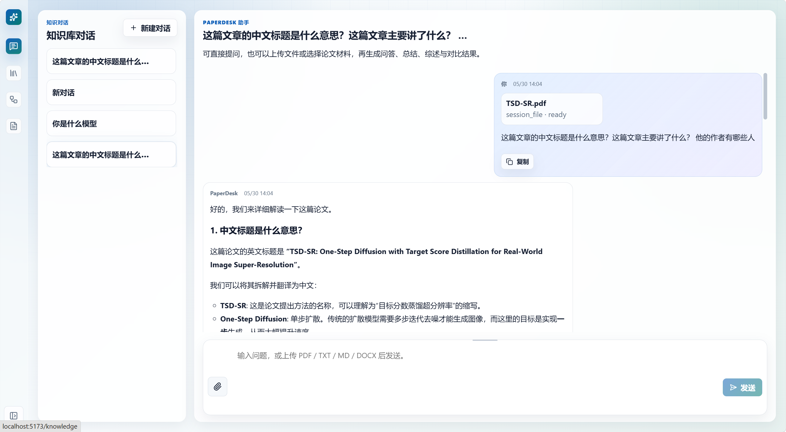
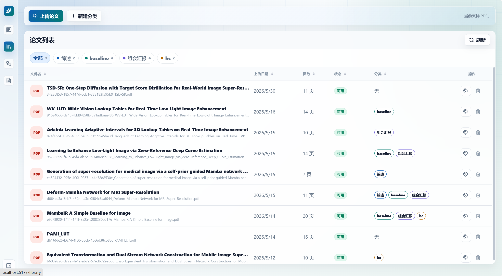
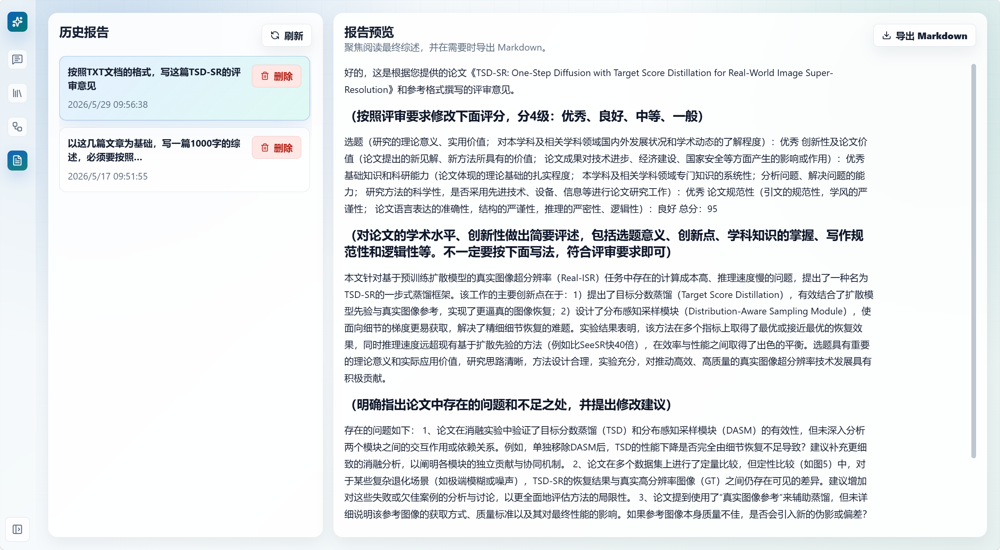
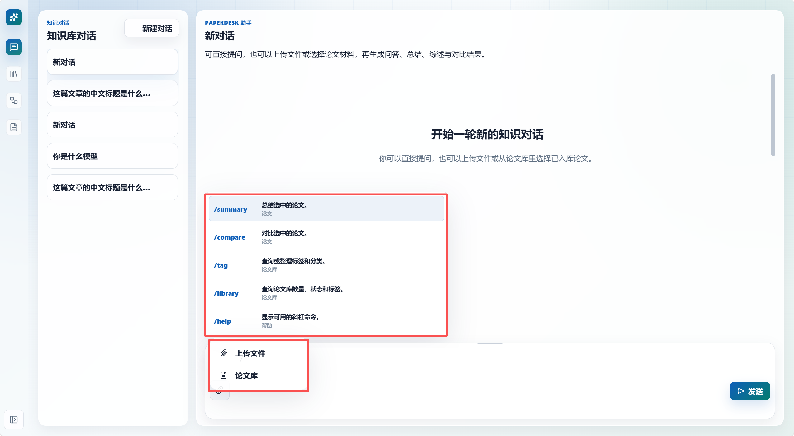

# PaperDesk 论文阅读 Agent

PaperDesk 是一个面向论文阅读、论文库管理和研究写作的本地 Agent 应用。项目以 `Agent Core + Domain Pack + Infrastructure Adapter` 为核心结构：Agent Core 负责路由、运行时、工具、技能、安全和可观测；PaperDesk 的论文、工作区和报告能力沉淀为独立 domain pack；模型、向量库、文件和外部集成放在 infrastructure 边界。

项目保留完整论文业务闭环：论文上传、PDF 解析、论文库、RAG 问答、选中文章综述、标签分类管理、报告保存、普通聊天、会话文件和工作区文件操作。同时，架构为后续接入 draw.io、token 消耗查看、外部知识源、MCP 等能力预留了清晰扩展点。

## 技术栈

| 模块 | 技术 |
| --- | --- |
| 前端 | Vue 3, TypeScript, Vite |
| 后端 | FastAPI, Pydantic, SQLite |
| Agent | Lifecycle, Capability Registry, Runtime Dispatcher, Tool Registry, Skills, Trace |
| RAG | PDF parsing, chunking, embedding, Milvus, metadata filter, evidence assembly |
| 工程能力 | SSE streaming, write confirmation, route trace, runtime metrics, OpenSpec |

## 截图

> 以下为截图占位。请将图片保存到 `docs/images/readme/` 后替换对应文件名。

| 对话与 RAG | 论文库与标签 |
| --- | --- |
|  |  |

| 报告保存 | Skills 与会话文件 |
| --- | --- |
|  |  |

## 核心能力

- 论文上传与解析：上传 PDF 后解析文本、切分 chunk、写入论文库并建立向量索引。
- 论文库问答：支持全库检索、选中文档范围、metadata 过滤、证据拼接和引用信息。
- 选中文章综述：根据当前选择的论文生成总结、对比、方法解释和综述草稿。
- 标签与分类管理：支持查看、创建、更新和分配分类；写操作需要明确 scope。
- 报告保存与导出：可将聊天中的研究结果保存为报告，并导出 Markdown。
- 普通聊天：无论文意图时走轻量 direct chat，不强行进入 RAG 或工具链。
- 工作区文件：支持会话文件上传、工作区文件读取、生成文件和覆盖确认。
- 自定义 Skills：支持内置和用户自定义 skill，允许绑定工具，并受 route/capability/tool policy 约束。
- Trace 与调试：记录 route、capability、skill、context、tool policy、RAG evidence、runtime、错误原因等信息。

## 架构总览

```text
Frontend Vue
  -> FastAPI Routes
  -> Application Use Cases
  -> Agent Core
       lifecycle      ingress / route / capability / context / tool policy
       capabilities   paper / workspace / chat / research / future extension
       runtimes       direct / paper rag / tool / write / report / workspace / experimental
       tools          registry / schema / risk / read-write type / observation
       skills         builtin + custom discovery / trigger / tool binding
       safety         pending action / explicit scope / workspace path guard
       observability  trace / metrics / response finalization
  -> Domain Packs
       paper          upload / parse / chunk / retrieval / tags / reports / research agents
       workspace      session files / workspace files / workbench views
       artifact       report export / future generated artifacts
  -> Infrastructure
       llm / files / vectorstore / persistence / integrations
```

主要目录：

```text
backend/app/api                  HTTP 与 SSE API
backend/app/application          Chat、PaperUpload、Report、Workspace 用例
backend/app/agent                可复用 Agent Core
backend/app/agent/capabilities   Capability 声明与注册
backend/app/agent/lifecycle      Ingress、route、lifecycle service
backend/app/agent/runtimes       Runtime dispatcher 与 route executors
backend/app/agent/tools          Tool Registry、policy、observation
backend/app/agent/skills         Skill Registry、selector、context
backend/app/agent/safety         Pending action、写安全、workspace path guard
backend/app/agent/observability  Trace、RAG trace、response recorder
backend/app/domains/paper        论文业务闭环与 research agents
backend/app/domains/workspace    工作区文件与 Workbench
backend/app/domains/artifact     报告导出与产物
backend/app/infrastructure       LLM、文件、向量库、外部集成
```

`backend/app/services`、`backend/app/runtime`、`backend/app/agents` 中仍保留部分兼容导出，用于稳定旧测试和旧导入。新代码优先使用 `app.agent.*`、`app.domains.*`、`app.infrastructure.*`。

## Agent 生命周期

每次聊天请求都会经过一条可追踪的生命周期：

```text
User Request
  -> API Route
  -> Application Use Case
  -> Agent Ingress
  -> Route Decision
  -> Capability Resolution
  -> Skill Selection
  -> Context Assembly
  -> Tool Policy
  -> Runtime Dispatch
  -> Response / Stream
  -> Trace and Metrics
```

关键对象：

- `RouteDecisionPacket`：记录 route、runtime、编排策略、scope、RAG/tool/confirmation 需求。
- `CapabilityDeclaration`：声明能力 id、routes、tools、domain package、infrastructure 依赖和文档摘要。
- `ToolPolicyDecision`：根据 route、capability、skill、scope、risk、确认状态过滤工具。
- `RuntimeMetricsEnvelope`：记录 route、runtime、capability、证据数、工具数、token 可用状态和错误信息。

## 编排策略

PaperDesk 每次请求选择一个主 runtime 和一个主编排策略，让普通聊天、论文 RAG、工具调用和实验 planner 保持边界清晰。

| 用户意图 | Route | 主策略 | Runtime |
| --- | --- | --- | --- |
| 普通聊天 | `direct_chat` | single-turn | `DirectChatRuntime` |
| 论文问答、总结、对比 | `paper_rag` | retrieve-then-synthesize | `PaperRagRuntime` |
| 论文库只读查询 | `library_read` / `tool_action` | bounded-react | `ToolActionRuntime` |
| 标签、分类、删除、覆盖等写操作 | `write_pending` / `write_confirmed` | preview-confirm-execute-verify | `ToolActionRuntime` / `ConfirmedWriteRuntime` |
| 报告保存和导出 | `report_action` | service-workflow | `ReportActionRuntime` |
| 工作区文件 | `workspace_read` / `workspace_write` | service-workflow / preview-confirm | `WorkspaceActionRuntime` |
| 实验研究能力 | `experimental_research` | plan-execute-replan | `ExperimentalRuntime` |

Planner、reflection、MCP、subagent、research-task runtime 位于 `backend/app/agent/runtimes/experimental/`，默认论文阅读路径不会自动进入这些实验能力。

## RAG 设计

PaperDesk 的 RAG 以论文阅读为中心，保留必要能力：

- PDF 解析：提取页面文本和基础 metadata。
- Chunk 切分：按页面和段落生成可召回片段，保留页码、标题、文档 id、版本等 metadata。
- Embedding：通过 infrastructure LLM/embedding 边界生成向量。
- 向量库：使用 Milvus 执行向量召回。
- 范围控制：支持选中文档、文档 id、分类/标签等过滤。
- 证据拼接：将文本片段、页码、标题和文档信息拼入模型上下文。
- 输出边界：证据不足时明确说明，不把无证据内容包装成确定结论。

## Skills

Skills 位于 `backend/app/agent/skills`，支持内置和用户自定义。一个 skill 可以声明：

- `skill_id`、名称、描述；
- 触发命令、关键词、route、task type、附件类型；
- `capability_ids`；
- `allowed_tool_ids`；
- 输出协议和引用要求。

示例：

```json
{
  "skill_id": "custom_review",
  "name": "自定义论文评审",
  "enabled": true,
  "capability_ids": ["paper"],
  "allowed_tool_ids": ["search_local/vector_recall_default"],
  "trigger": {
    "keywords": ["custom-review"],
    "routes": ["paper_rag"],
    "capability_ids": ["paper"]
  }
}
```

Skill 只声明意图和允许绑定的工具。真正暴露给 runtime 的工具还需要经过 Tool Registry、route、capability、scope、risk、feature flag 和确认状态过滤。

## Tool Registry 与写安全

所有工具通过 `backend/app/agent/tools` 声明 metadata：

- tool id、描述、schema；
- capability id、scope、integration source；
- read/write 类型；
- operation level；
- risk level；
- 是否 destructive；
- 是否需要确认；
- verification 和 observation 规则。

写操作统一走：

```text
preview -> pending action -> explicit confirmation -> execute -> optional verification
```

安全规则：

- 模糊指代不会默认执行全库写操作。
- 删除、覆盖、清空、批量改标签必须有明确 scope。
- 未确认前不暴露危险写工具。
- 工具结果统一回灌为结构化 observation，便于 trace 和调试。

## Capability 扩展

新增能力优先以 capability 接入：

```text
backend/app/agent/capabilities        声明 capability
backend/app/domains/<capability>      放置业务逻辑
backend/app/agent/tools               声明工具 schema 与风险
backend/app/infrastructure            放置外部适配器
backend/app/application / api         暴露应用用例和接口
README.md / docs                      同步说明
```

示例方向：

- `drawio`：在 `domains/artifact` 或 `domains/drawio` 中维护图形产物，在 `infrastructure/integrations/drawio` 中接入外部 API，在 Tool Registry 声明创建、编辑、导出工具。
- `token_usage`：在 `agent/observability` 中扩展 usage 聚合，在 Tool Registry 声明只读查询工具，通过 API 暴露会话维度的 token、latency、cost 信息。

## Observability

Agent 运行过程记录轻量 trace 和 metrics：

- route、runtime、orchestration pattern；
- active capability；
- active skill；
- context scope；
- allowed/filtered tools；
- RAG evidence count 与 metadata filter；
- pending action 与写操作 scope；
- response status、error reason；
- token usage availability。

当模型供应商没有返回 token 信息时，系统记录 `token_usage_available=false`，请求仍可正常完成。

## 快速启动

后端：

```bash
cd backend
uv sync
.venv\Scripts\python.exe -m uvicorn app.api.main:app --reload --host 127.0.0.1 --port 8000
```

前端：

```bash
cd frontend
npm install
npm run dev
```

默认访问：

```text
Frontend: http://127.0.0.1:5173
Backend:  http://127.0.0.1:8000
```

## API 概览

| 能力 | API |
| --- | --- |
| 会话列表 | `GET /api/chat/sessions` |
| 创建会话 | `POST /api/chat/sessions` |
| 发送消息 | `POST /api/chat/sessions/{session_id}/messages` |
| SSE 流式消息 | `POST /api/chat/sessions/{session_id}/messages/stream` |
| 上传论文 | `POST /api/documents/upload` |
| 文档列表 | `GET /api/documents` |
| RAG 问答 | `POST /api/rag/ask` |
| 报告列表 | `GET /api/reports` |
| 保存报告 | `POST /api/reports/from-message` |
| Workbench trace | `GET /api/workbench/messages/{message_id}/trace` |

## 验证

常用命令：

```bash
backend\.venv\Scripts\python.exe -m compileall -q backend\app backend\tests
backend\.venv\Scripts\pytest.exe -q backend\tests
cd frontend
npm run build
```

OpenSpec：

```bash
openspec validate agent-core-ownership-cleanup --strict
openspec validate --all
```

## FAQ

**普通聊天会进入论文库吗？**

不会。无论文意图、无选中文档、无工具需求时使用 `direct_chat`。

**ReAct、Plan-Execute-Replan 会同时跑吗？**

每个请求只选择一个主编排策略。Plan-Execute-Replan 保留在实验研究 runtime 中。

**用户自定义 Skills 可以绑定工具吗？**

可以。绑定结果还会经过 Tool Registry 和安全策略过滤。

**写操作为什么需要确认？**

标签、分类、删除、覆盖、报告保存等操作会改变本地数据，需要明确 scope 和用户确认。

## 联系

项目维护者：Hddcc

GitHub：<https://github.com/Hddcc/Paperdesk>
