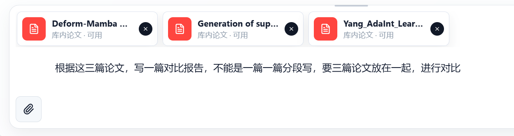
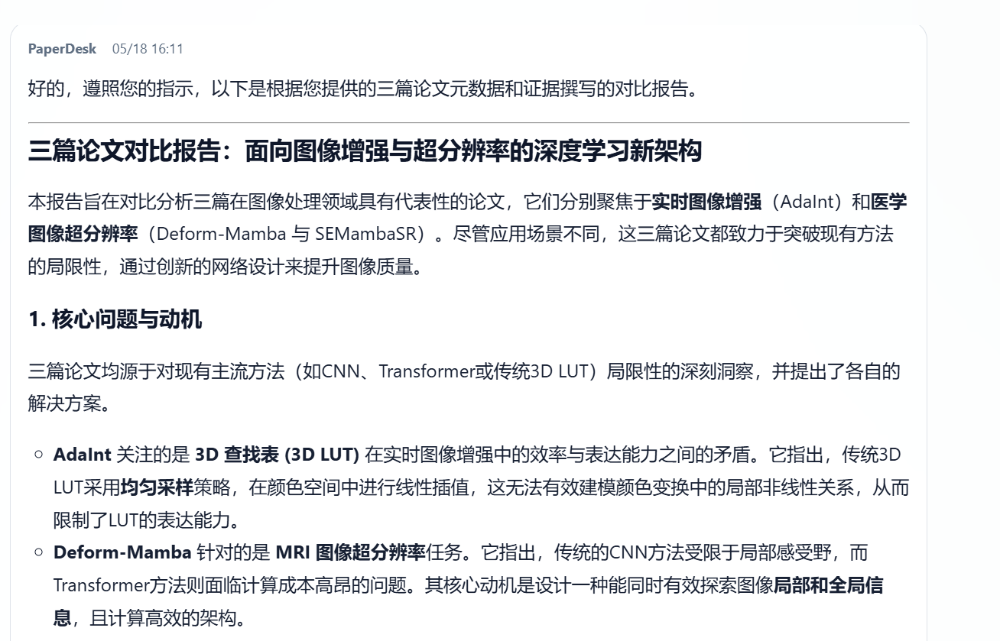
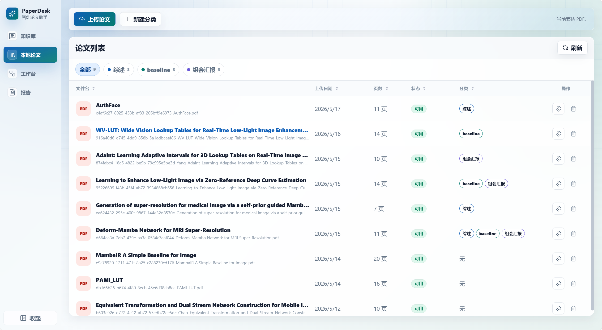
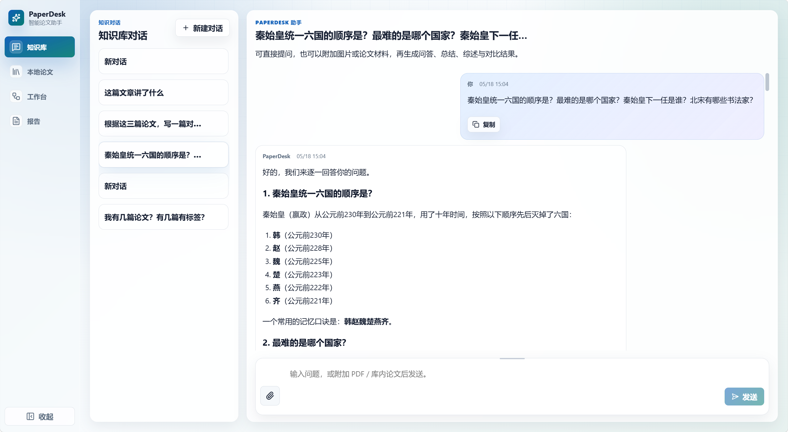
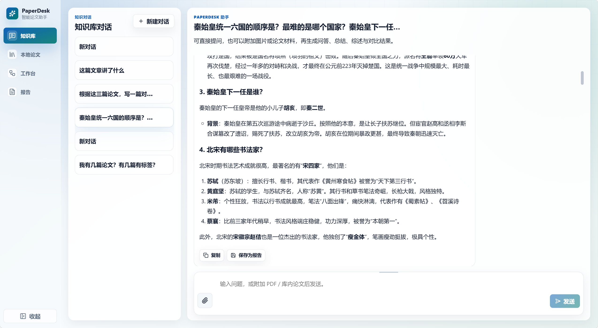
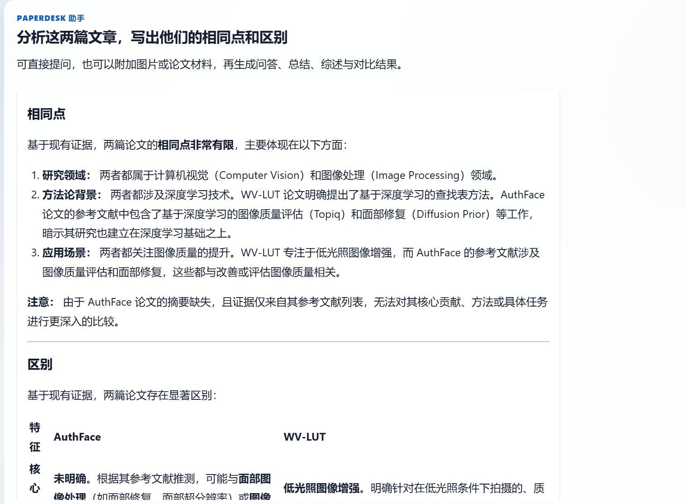
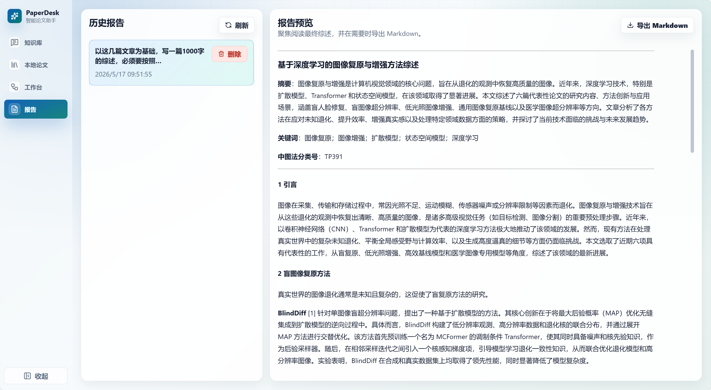
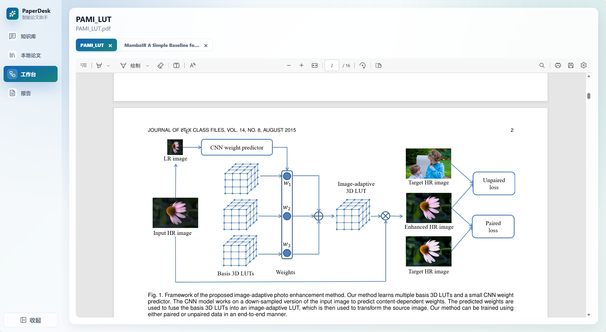

# PaperDesk

PaperDesk 是一个面向科研论文管理、论文问答、AI 分析和报告沉淀的本地优先论文工作台。它围绕“把自己的论文库变成可检索、可分析、可沉淀的研究助手”这一目标，提供从论文入库到知识问答、报告保存和 Markdown 导出的完整流程。

> Tips
>
> 本项目为纯 vibe coding 项目，可以用来学习参考，也欢迎你在这个基础上继续改进和扩展。

## 1. 系统功能介绍

PaperDesk 的核心目标是让用户把本地论文库真正用起来：先把 PDF 上传到本地论文库，再由系统完成解析、切分、索引和检索，之后就可以在知识库对话中选择论文、提出问题、生成总结、对比多篇论文，或者把一次分析结果保存为报告并导出为 Markdown。






### 1.1 本地论文库管理

用户可以在 `Library` 页面上传 PDF。PaperDesk 会为论文建立本地记录，解析正文内容，切分为可检索片段，并写入本地知识库索引。上传后的论文会显示处理状态、页数、文件名、标题和分类标签，方便用户判断论文是否已经可以用于问答和分析。

论文库支持基础的整理操作，包括查看全部论文、刷新处理状态、删除论文记录、打开 PDF 阅读入口，以及按分类筛选论文。当前主要支持 PDF 文件。



### 1.2 AI 论文问答与分析

在 `Knowledge` 页面，用户可以直接和 PaperDesk 助手对话，也可以从论文库中选择一篇或多篇已入库论文，让 AI 围绕这些论文进行回答。常见用法包括：

- 解释某篇论文的核心问题、方法、贡献和局限。
- 对比多篇论文的研究目标、技术路线和实验差异。
- 根据选中的论文生成总结、综述、阅读笔记或研究分析。
- 结合论文库中的证据回答用户提出的具体问题。

PaperDesk 会尽量基于库内论文的真实检索结果来回答，并把模型的表达能力用于整理、解释和组织这些证据。对于证据不足的情况，系统会在回答中保留说明，避免把缺少证据支撑的内容写成确定结论。

PaperDesk 也可以作为普通 AI 助手使用。用户没有要求基于论文库、上传论文、所选论文或文献证据回答时，系统会按普通问答自然回复；当用户选择论文，或者提到论文库、标签、分类、报告时，系统会进入论文库工具流程。

普通对话：




论文分析：




### 1.3 报告保存与 Markdown 导出

用户在对话或研究流程中生成的重要结果，可以保存为报告。普通聊天回答不会自动进入报告列表；只有用户点击保存，或者明确要求“把这次回答保存为报告”后，结果才会进入 `Reports` 页面。`Reports` 页面会展示历史报告列表，支持预览报告正文，并将报告导出为 Markdown 文件，方便继续整理到笔记系统、论文阅读记录或项目文档中。



### 1.4 论文分类与标签整理

PaperDesk 支持为论文创建分类，并把不同论文归入不同分类。用户可以给论文打上类似“综述”“待阅读”“方法论文”“实验对比”“中文资料”等标签，也可以按分类筛选论文库。

分类功能不仅用于前端整理，也会进入 Agent 的工具链。当用户问“某个标签下有哪些论文”“把这几篇论文归类到某个标签”“按分类总结论文”时，PaperDesk 会优先读取真实论文库和分类关系，再决定是否执行工具调用或生成回答。


### 1.5 PDF 阅读与多页面入口

PaperDesk 当前主要有四个产品入口：

- `/knowledge`：知识库对话主页，支持会话、附件、选择库内论文和知识库增强回答。
- `/library`：本地论文库，负责 PDF 上传、分类、解析、索引和 PDF 打开入口。
- `/research`：PDF 阅读区，用于查看从论文库打开的文档，也保留研究任务相关能力的后端入口。
- `/reports`：历史报告列表、报告预览和 Markdown 导出。



推荐体验顺序是：先在 `Library` 上传 PDF，等待文档进入可用状态；再到 `Knowledge` 选择论文并提问；如果生成了有价值的分析结果，可以保存到 `Reports`；最后在 `Reports` 预览并导出 Markdown。

## 2. 快速使用

PaperDesk 的启动目标是尽量简单：从 GitHub 下载项目后，主要只需要复制环境文件、填写必要参数，然后分别启动后端和前端即可。

### 2.1 环境要求

本地需要准备：

- Python 3.10 或更高版本。
- `uv`，用于安装和运行后端 Python 依赖。
- Node.js 和 npm，用于安装和运行前端。
- Windows 用户建议安装并启动 Docker Desktop，因为 Windows 下默认会尝试自动启动本地 Milvus 容器作为向量库。

说明：当前项目没有提供完整的 `docker-compose` 一键部署。你可以使用外部 Milvus 服务，也可以使用项目默认的本地向量库启动策略。Windows 下如果希望自动拉起本地 Milvus 容器，需要 Docker Desktop 正常运行。

### 2.2 下载项目

```bash
git clone <your-repo-url>
cd paperdesk
```

### 2.3 配置后端环境变量

复制后端环境变量模板：

```bash
cd backend
cp .env.example .env
```

然后编辑 `backend/.env`。最常用的大模型配置是：

```env
LLM_PROVIDER=openai
LLM_BASE_URL=
LLM_API_KEY=你的模型 API Key
LLM_MODEL=gpt-4o-mini
```

如果使用兼容 OpenAI 接口的模型服务，可以按服务商要求修改：

```env
LLM_PROVIDER=deepseek
LLM_BASE_URL=https://api.deepseek.com
LLM_API_KEY=你的 API Key
LLM_MODEL=你的模型名称
```

论文检索相关的 OpenAlex API Key 是可选项，不填写也可以运行：

```env
OPENALEX_API_KEY=
```

向量库相关配置默认可以先不改。Windows 下如果 `MILVUS_URI` 留空，后端默认会尝试连接本机 Milvus，并在允许的情况下自动启动名为 `paperdesk-milvus` 的 Docker 容器；如果你有现成的 Milvus 服务，可以直接填写：

```env
MILVUS_URI=http://127.0.0.1:19530
```

默认 embedding 配置使用本地模型：

```env
EMBEDDING_PROVIDER=local
EMBEDDING_MODEL=BAAI/bge-m3
```

第一次启动时，后端可能会下载本地 embedding 模型。如果默认 Hugging Face 下载较慢，可以按自己的网络环境配置镜像地址或本地缓存。

### 2.4 启动后端

在 `backend` 目录中运行：

```bash
uv sync
uv run uvicorn app.api.main:app --reload --port 8000
```

启动后可以访问健康检查地址：

```text
http://localhost:8000/healthz
```

如果使用 Windows 且 Milvus 自动启动失败，请先确认 Docker Desktop 已经启动，并检查 Docker 是否可以正常运行。

### 2.5 配置并启动前端

打开新的终端窗口，进入前端目录：

```bash
cd frontend
cp .env.example .env
npm install
npm run dev
```

前端默认会连接：

```env
VITE_API_BASE_URL=http://localhost:8000
```

启动成功后，根据终端提示打开 Vite 提供的本地地址，通常是：

```text
http://localhost:5173
```

### 2.6 推荐使用流程

1. 打开前端页面，进入 `Library`。
2. 上传一篇或多篇 PDF。
3. 等待论文状态变为可用。
4. 进入 `Knowledge`，从论文库选择论文并提问。
5. 对有价值的回答点击保存为报告。
6. 进入 `Reports` 预览报告，并导出 Markdown。

### 2.7 常用校验命令

后端测试：

```bash
cd backend
.\.venv\Scripts\pytest.exe -q
```

前端构建：

```bash
cd frontend
npm run build
```

如果在 macOS 或 Linux 上运行后端测试，可以使用：

```bash
cd backend
uv run pytest -q
```

## 3. 项目结构

```text
paperdesk/
├─ README.md                     # 项目首页说明
├─ docs/
│  └─ images/                   # README 截图资源
├─ frontend/
│  ├─ src/                      # Vue 3 前端页面、状态和接口封装
│  ├─ package.json              # 前端依赖与脚本
│  ├─ package-lock.json         # 前端锁文件
│  ├─ vite.config.ts            # Vite 配置
│  └─ .env.example              # 前端环境变量示例
├─ backend/
│  ├─ app/
│  │  ├─ api/                   # FastAPI 路由与依赖注入
│  │  ├─ models/                # 数据模型与协议定义
│  │  ├─ repositories/          # SQLite 仓储层
│  │  ├─ runtime/               # Agent runtime、工具注册和调度
│  │  └─ services/              # RAG、建库、上下文、报告等服务
│  ├─ tests/                    # 后端测试
│  ├─ pyproject.toml            # 后端项目配置
│  ├─ uv.lock                   # 后端锁文件
│  └─ .env.example              # 后端环境变量示例
└─ .gitignore                   # 仓库忽略规则
```

如果你准备按代码阅读项目，比较推荐的顺序是：先看 `frontend/src/views` 了解页面入口，再看 `backend/app/api/main.py` 了解后端装配，然后继续顺着 `services`、`runtime`、`repositories` 往下读。

## 4. Agent 架构介绍

### 4.1 Agent 总体设计

PaperDesk 的 Agent 围绕本地论文库工作。用户上传论文后，系统会解析 PDF、切分正文、建立索引；当用户在对话中选择论文并提出问题时，Agent 会判断是否需要读取论文库、检索证据、调用工具、生成回答，或者把结果保存为报告。

#### 4.1.1 核心目标

Agent 的核心目标是让论文库中的真实内容参与回答，同时保留普通 AI 助手的自然问答能力。用户问通用概念、历史常识、编程解释或系统使用建议时，系统可以直接回答，不会因为论文库里没有证据就拒绝回答。用户明确要求根据论文库、上传论文、所选论文或文献证据回答时，系统才会使用论文库证据边界。

当问题涉及选中论文、分类标签、库内证据或多篇论文对比时，系统会优先读取论文库和检索结果，再组织答案。这样得到的回答会尽量贴近用户自己的论文材料。

这条主线从 PDF 入库开始，到 Knowledge 对话中的证据检索和回答生成结束。报告保存属于用户主动沉淀的动作，适合把一次有价值的总结、对比或分析结果留到 Reports 页面继续整理。

#### 4.1.2 主链路入口

当前最稳定的入口是 `Knowledge`、`Library` 和 `Reports`。`Library` 负责论文入库、解析、索引和分类整理；`Knowledge` 负责围绕论文库提问、检索证据、调用工具和生成回答；`Reports` 负责查看已保存报告和导出 Markdown。

`Research` 当前主要承担 PDF 阅读入口，同时后端保留了研究任务相关能力。研究任务适合更长的研究型流程，例如分步骤整理主题、补充证据并生成草稿报告，但它不是普通 Knowledge 对话的默认执行路径。

#### 4.1.3 能力边界

PaperDesk 当前稳定主线是本地论文库问答、分类标签整理、RAG 证据回答和报告保存。MCP、Subagent、Skills、Planner、Reflection 和 Research 任务都保留为学习和扩展能力，需要明确入口、配置开关或清楚的用户意图才会参与。

这种划分让日常问答保持直接，也让高风险写操作和长任务有单独的保护流程。用户问一篇论文的创新点，不会被自动升级成复杂研究任务；用户要求删除、清空或移除数据时，系统会先确认影响范围。

### 4.2 路由决策与运行路径

PaperDesk 在每轮对话开始时会先判断用户意图。系统会判断用户是在普通问答、论文问答、整理标签、修改分类、保存报告，还是在纠正上一轮回答。这个判断会影响后续是否读取论文库、是否调用工具、是否需要确认，以及最终回答应该采用普通回答还是证据型回答。

系统会结合规则判断和大模型判断来选择处理路径：规则用于保护高风险场景，大模型用于结合上下文、用户问题和可用能力判断更合适的处理方式。最终系统会在两者之间做裁决，让普通问题保持灵活，让危险操作保持稳妥。

#### 4.2.1 路由流程

路由会读取当前用户问题、已选论文、附件、最近对话、用户偏好和可用工具。规则会优先检查删除、清空、移除、覆盖、重建、批量修改、纠错、选中文档问答和论文库写入这类强约束场景；如果命中了这些场景，系统会把请求送入工具流程、确认流程或纠错流程。

大模型判断主要用于补充语义理解。它会结合当前问题、上下文、附件、已选论文和可用工具给出候选判断。例如用户没有直接说“查论文库”，但当前已经选中了论文，又问“它的方法有什么问题”，系统会把这个问题识别为论文问题。模型输出还会经过可用性检查，工具不存在、风险等级不匹配或结果不可靠时，系统会回到规则判断。

#### 4.2.2 普通回答与工具流程

普通概念问题、历史常识、编程解释、使用建议和不依赖论文库的问题会走直接回答路径。这类问题不需要检索本地论文，也不会调用标签或报告工具。比如“RAG 是什么”“怎么阅读一篇论文”这类问题，可以直接结合上下文回答。

涉及下面这些内容的问题，会走工具型流程：

- 选中论文
- 论文库
- 标签与分类
- 证据检索
- 历史报告

Agent 会先确认目标论文、标签或报告范围，再调用读取、检索或生成类工具。拿到工具结果后，系统会继续判断证据是否足够，必要时补查证据，最后基于真实结果生成回答。

#### 4.2.3 写操作确认

写操作会进入更谨慎的路径。

- 新增分类、给论文追加标签这类非破坏性操作，可以在校验后执行。
- 删除、清空、移除、覆盖、重建这类可能影响数据的操作，会先展示影响范围，等用户确认后再执行。

系统会区分实体操作和关系操作：

- 删除空标签分类，是删除没有论文关联的分类实体。
- 清空某篇论文的标签，是清除论文和标签之间的关系。
- 把某篇论文归到某个分类，是修改这篇论文与分类之间的关系。

前者不应影响已有论文的标签关系，后者不应删除标签实体。执行后，系统会再次读取当前状态，用真实结果验证操作是否生效。

### 4.3 上下文与记忆管理

PaperDesk 的上下文管理负责决定本轮回答要带哪些材料给模型。它会把系统规则、历史对话、会话摘要、用户偏好、附件说明、论文证据和本轮问题组织到一起，并在调用模型前估算整体长度。

#### 4.3.1 上下文组成

一轮对话的上下文通常由几类内容组成：

- 系统规则：用于约束回答方式和安全要求。
- 用户偏好：用于记录语言、引用、结构等稳定习惯。
- 会话摘要：用于保留较早对话的重点。
- 附件说明和选中论文：用于告诉 Agent 当前讨论对象。
- RAG 证据：用于支撑论文问答。
- 最近对话：用于保持连续追问的语境。

当前配置下，模型上下文窗口按 `128k token` 估算，并给回答预留 `16k token`，所以输入材料可用预算是 `112k token`。如果用户修改模型或显式配置上下文窗口，系统会按新的配置重新计算预算。

#### 4.3.2 预算估算

系统会在调用模型前估算即将放入上下文的内容，主要包括：

- 系统规则
- 历史对话
- 会话摘要
- 用户偏好
- 附件说明
- 论文证据
- 本轮问题

估算时会把聊天消息的结构开销、文本内容、图片占位和证据片段都算进去。

文本估算会优先使用与当前模型匹配的 tokenizer；如果 tokenizer 不可用，就使用保守估算：

- 英文等 ASCII 字符，大约按 4 个字符 1 个 token 计算。
- 中文等非 ASCII 字符，按更高密度计算。
- 图片，按固定占位成本估算。

默认预警阈值是输入材料预算的 72%，约 `80.64k token`；强制压缩阈值是输入材料预算的 90%，约 `100.8k token`。预警线用于提前整理容易膨胀的论文证据，强制压缩线用于处理较早历史对话，避免旧内容挤占当前问题和回答空间。

#### 4.3.3 压缩策略

接近预算时，系统会优先压缩论文证据。压缩后的证据仍会保留来源、标题、页码和关键摘录，但会减少每条证据的长度。默认最多保留 8 条 RAG 证据，每条证据摘录控制在 420 个字符以内。

超过强制压缩阈值时，系统会压缩更早的历史对话，并保留最近 8 轮用户与助手原始对话。较早且尚未压缩过的消息会被整理成摘要。摘要优先由当前配置的大模型生成；如果没有可用模型配置，或者摘要调用失败，系统会使用本地摘要逻辑兜底。

摘要会保存到运行时上下文中。下一轮组装上下文时，系统会读取摘要，同时跳过已经压缩过的原文，避免同一段历史重复占用上下文。这样较早对话仍然能提供背景，最近追问也能保持原始表达。

#### 4.3.4 记忆分层

PaperDesk 的短期记忆来自最近 8 轮原始对话，用来保持当前话题的连续性。会话摘要会保存到运行时上下文里，记录当前主题、已经引用过的论文、待处理问题和较早对话重点。

长期偏好会从用户消息中识别并保存，例如用户要求以后用中文、回答要带引用、默认先总结再展开、默认使用 Markdown 结构等。引用记忆来自用户选择或上传过的论文，系统会记录这些论文与当前会话的关系，后续回答和记忆快照可以读取这些信息。

反思经验来自可选反思流程，不是每轮默认运行。用户明确纠错、要求重新检查，或者工具结果异常时，系统可以把有复用价值的经验写入记忆，用于后续路由和回答质量检查。

### 4.4 Agent Loop 与工具调用

Agent Loop 负责把用户目标拆成可执行动作。它会根据问题选择下一步，调用论文库、检索、分类、报告或记忆相关工具，拿到工具结果后再判断是否继续检索、补查证据、生成回答或进入确认流程。

#### 4.4.1 完整流程

完整流程通常从确认目标开始。用户问某篇论文时，Agent 会先确定是哪篇论文；用户问某个标签时，Agent 会先确认标签范围；用户要求对比多篇论文时，Agent 会先确定论文集合，再检索相关证据。

执行论文库操作前，系统会先判断操作对象和作用范围。用户说“这篇论文”时，系统会优先理解为当前或最近使用过的一篇论文；用户说“这些论文”“刚刚这几篇”时，系统会优先理解为最近选中或最近分析过的多篇论文；只有用户明确说“所有论文”“整个论文库”时，系统才会把范围扩大到全库。如果系统无法确定用户指的是哪篇或哪几篇论文，会先追问，而不会默认对全库执行。

每次工具调用后，系统会把结果整理成 Agent 可以继续读取的 Observation。Agent 会读取里面的论文、分类、证据、写入结果或错误信息，再决定下一步。信息足够时生成回答，信息不足时继续补查，目标不明确时请用户澄清，涉及危险写操作时进入确认流程。

#### 4.4.2 工具类型

工具可以按用途分成几类：

- 读取类：用于查看论文库状态、论文元数据、分类标签和报告信息。
- 检索类：用于从本地论文库中寻找证据。
- 写入类：用于创建分类、分配标签、清理关系或保存报告。
- 生成类：用于把证据整理成回答、分析或报告草稿。
- 记忆类：用于读取偏好、会话摘要和引用记录。
- 实验类：包括研究任务、MCP、Subagent、Skills、Planner 和 Reflection 相关能力。

标签和分类操作也会先区分对象层级。给“这篇论文”改标签，只作用于这篇论文；给“这些论文”打标签，只作用于这些论文；删除空标签分类，是删除没有论文关联的标签实体。把某篇论文的标签改成某个名称，不会被当成全局重命名标签；只有用户明确要求“把标签 A 重命名为 B”时，系统才会按标签实体重命名处理。

不同工具有不同权限和风险边界。读取类工具可以直接执行，写入类工具需要校验，删除和清空类操作需要确认。Agent 在选择工具时会同时考虑用户目标、当前路径和工具风险。

#### 4.4.3 Observation 读取

Observation 是工具调用后的观察结果。它会告诉 Agent 工具是否成功、查到了哪些论文、匹配到哪些标签、检索到了多少证据、是否需要继续操作，以及是否出现了错误。

论文库问题的最终回答会优先使用 Observation 中的真实结果。用户问某个分类下有几篇论文时，答案来自分类读取结果；用户问某篇论文的创新点时，答案来自检索到的论文片段；用户要求保存报告时，答案会基于保存后的读取校验结果。

#### 4.4.4 写操作校验

写操作执行前会先确认目标和影响范围。系统会说明要修改的是论文实体、分类实体、报告实体，还是论文与分类之间的关系。目标不明确时，系统会先询问澄清，不会直接执行，也不会把模糊范围默认扩大到全库。

执行后，系统会再次读取状态验证结果。创建分类后会重新读取分类列表，给论文加标签后会重新读取该论文的标签，删除空分类后会确认被删除的是空分类实体，清空论文标签后会确认只移除了目标论文的标签关系。删除、清空、移除和全库批量操作会进入确认或澄清流程。校验失败时，回答会明确提示需要检查，而不会只说操作成功。

### 4.5 报告沉淀与研究任务

PaperDesk 把报告视为用户主动沉淀的结果。对话回答、报告草稿、已保存报告和 Markdown 导出是不同状态，系统会尽量让用户知道当前内容只是聊天回答，还是已经进入 Reports 页面。

#### 4.5.1 报告保存

普通聊天不会自动保存报告。用户明确点击保存按钮，或者在对话中要求“保存为报告”“把刚才的回答保存成报告”后，系统才会把对应回答保存到 Reports 页面。保存时会记录来源消息、关联论文和引用信息，并在保存后重新读取报告，确认标题、正文和关联信息可用。

如果用户只是要求“写一份综述草稿”，系统可以生成可阅读的草稿内容，但不会自动把所有长回答都塞进报告列表。覆盖已有报告和删除报告属于高风险写操作，需要先确认影响范围。

#### 4.5.2 Markdown 导出

Markdown 导出用于把已保存报告导出成文件，方便放入笔记系统、论文阅读记录或项目文档。导出动作不会自动创建新的报告记录，也不会把普通聊天回答变成报告。

用户可以在 `Reports` 页面预览报告正文，再点击导出 Markdown。导出的内容来自已保存报告，系统会保持报告正文和导出内容一致。

#### 4.5.3 研究任务边界

Research 任务适合更长的研究型流程，例如围绕一个主题规划多个子问题、检索本地或外部证据、逐步形成报告草稿。它保留后端能力和扩展入口，但不是普通 Knowledge 对话的默认流程。

普通“总结这篇论文”“对比这两篇论文”会优先走 Knowledge 的论文库工具流程。只有用户明确要求创建研究任务、分步骤执行长任务，或者通过研究任务入口发起请求时，系统才会考虑研究任务流程。默认配置下，从 Knowledge 自动升级到研究任务需要显式允许。

### 4.6 扩展能力

PaperDesk 保留了一组扩展能力，用于学习 Agent 架构和后续增强。它们有价值，但当前不会压过本地论文库问答这条稳定主线。

#### 4.6.1 Planner 与 Reflection

Planner 用于明确复杂任务或长任务，例如用户要求先筛选论文、再分主题、再生成综述大纲。普通论文总结和简单对比不需要 Planner 参与。

Reflection 用于用户纠错、重新检查或回答质量检查。用户说“刚才不对”“重新检查引用来源”“你没有查论文库”时，系统可以回看上一轮回答和工具结果，再决定是否补查证据或修正回答。Reflection 不是每轮默认运行。

#### 4.6.2 MCP 与 Skills

MCP 当前主要用于只读外部工具接入和未来扩展，例如外部学术检索、论文元数据查询或网页读取。它默认不会参与本地论文库写操作，也不会成为 Knowledge 本地 RAG 的必需依赖。

Skills 用于描述研究任务的能力范围和未来扩展方向，例如论文总结、多论文对比、研究简报等任务需要哪些输入、适合哪些工具、产物应该是什么形式。Knowledge 默认问答不会每轮加载完整 Skills。

#### 4.6.3 Subagent

Subagent 保留任务登记、进度记录、结果记录和失败信息记录能力，适合未来把大任务拆成多个小任务。当前主研究流程和 Knowledge 对话仍以单主 Agent 按步骤推进为主。

在默认路径中，系统不会把普通论文问答自动拆给 Subagent 执行。只有实验配置开启、研究任务明确需要，或者调试教学入口显式要求时，Subagent 才适合参与。

## 5. 联系方式

如果你在使用、阅读代码或二次改造过程中遇到问题，欢迎通过邮箱联系我：

`531210118@qq.com`
